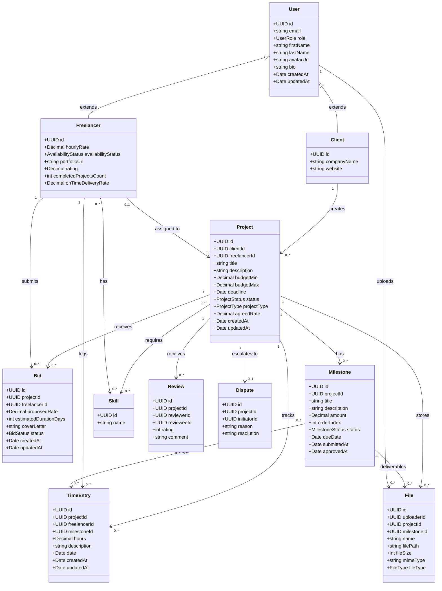
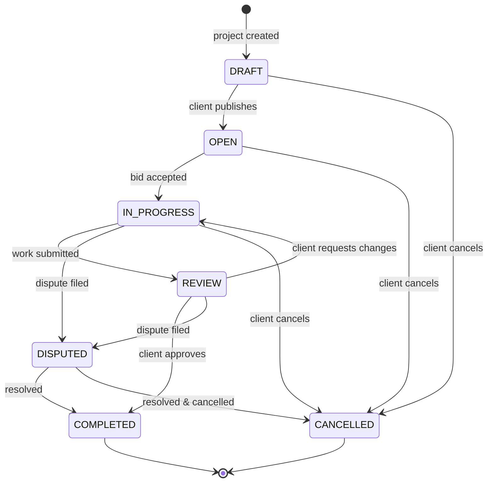
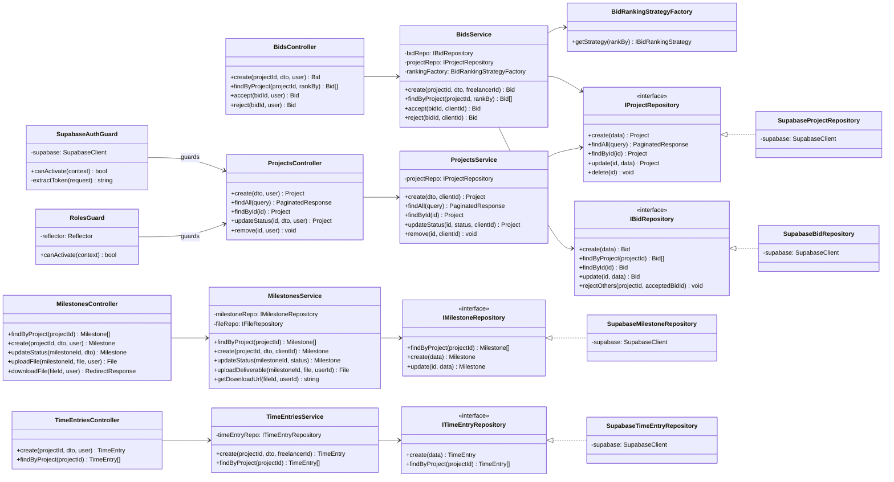
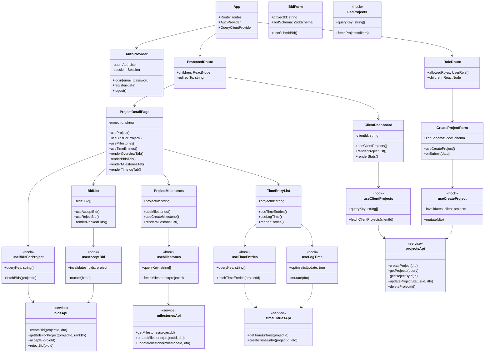
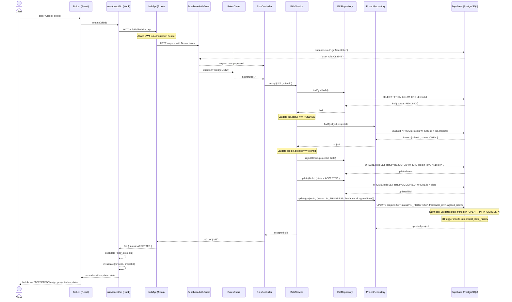
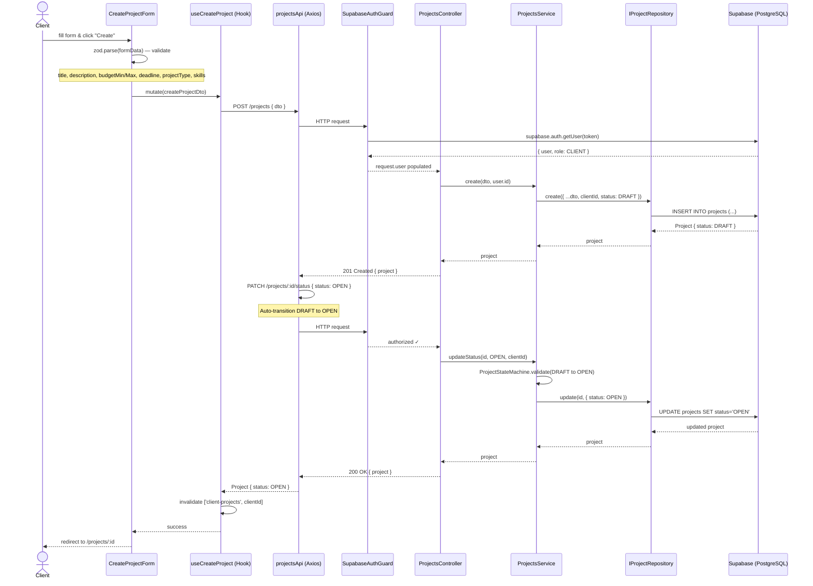
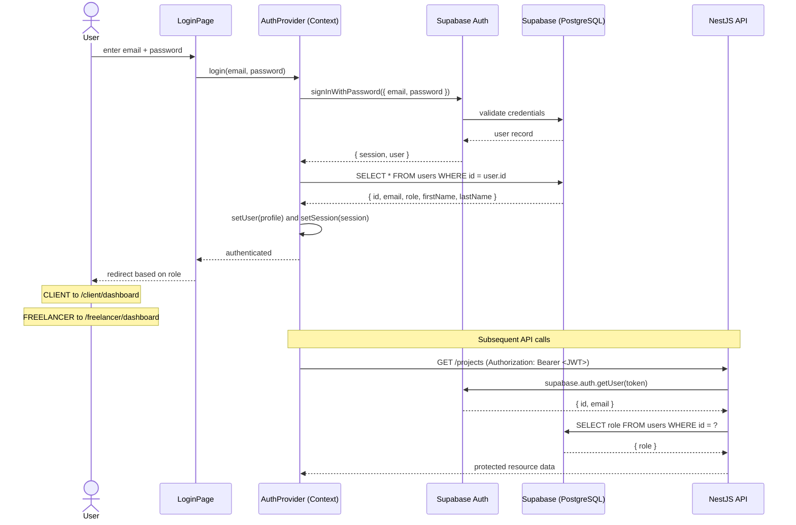

# UML Diagrams — Freelancer-Client Dashboard

## 1. Domain Entity Class Diagram

Core data models and their relationships (maps to PostgreSQL schema).

---

## 2. Project Status State Machine

---

## 3. Backend Architecture Class Diagram

NestJS layered architecture: Controller → Service → Repository → Supabase.

---

## 4. Frontend Component Architecture

React component tree, hooks, and API service layer.

---

## 5. Sequence Diagram — Bid Acceptance Flow

---

## 6. Sequence Diagram — Project Creation Flow

---

## 7. Sequence Diagram — Authentication Flow

